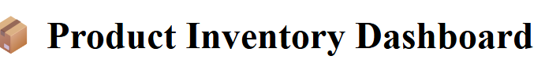
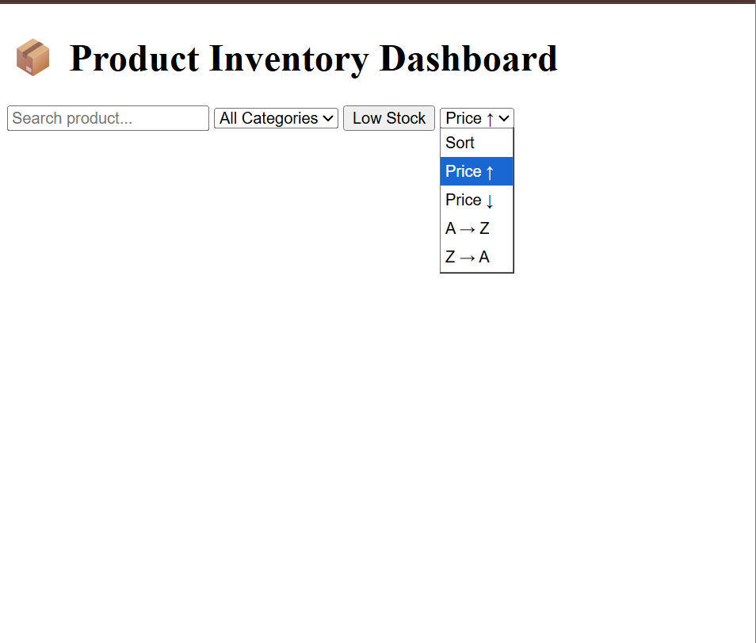
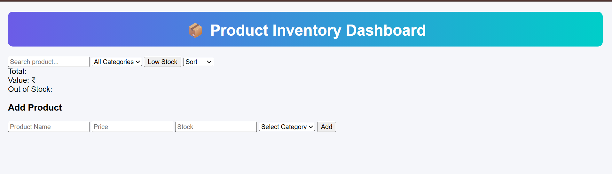
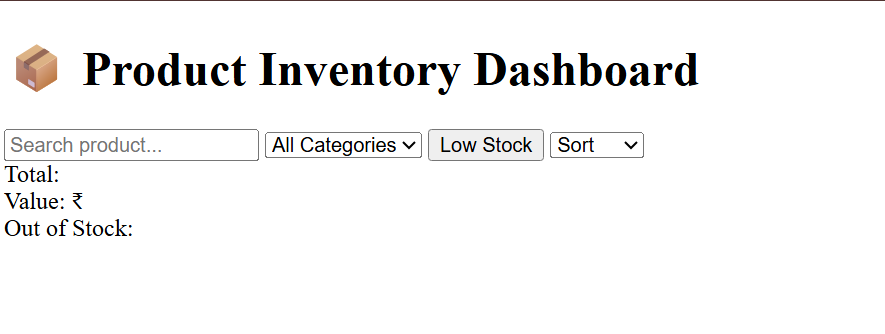
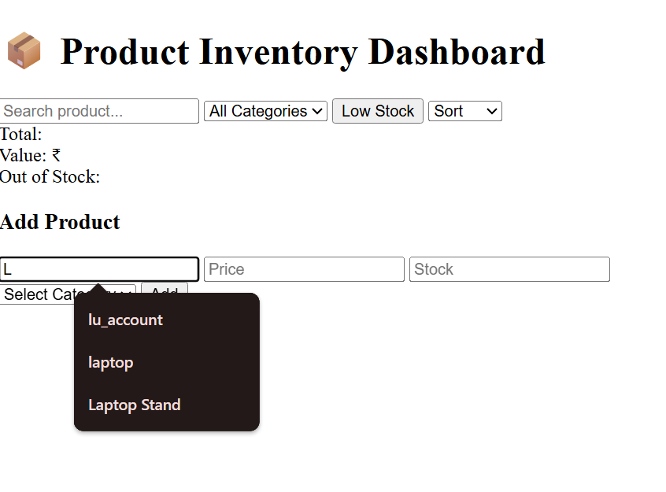
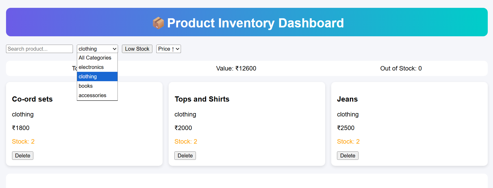
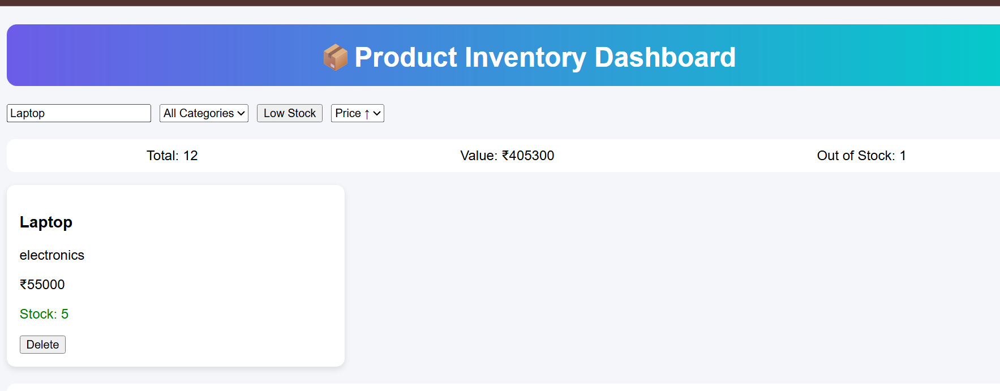
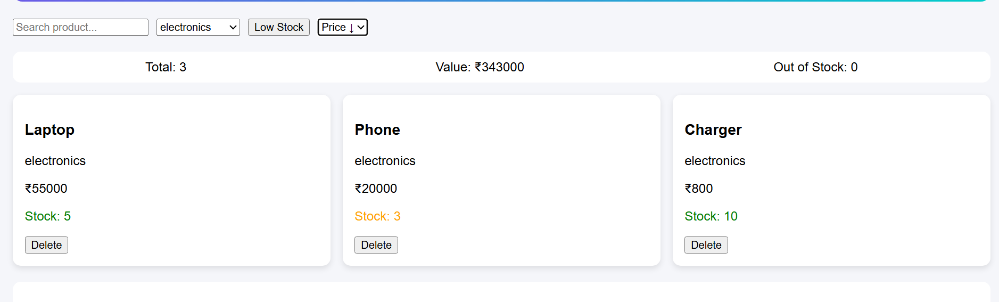
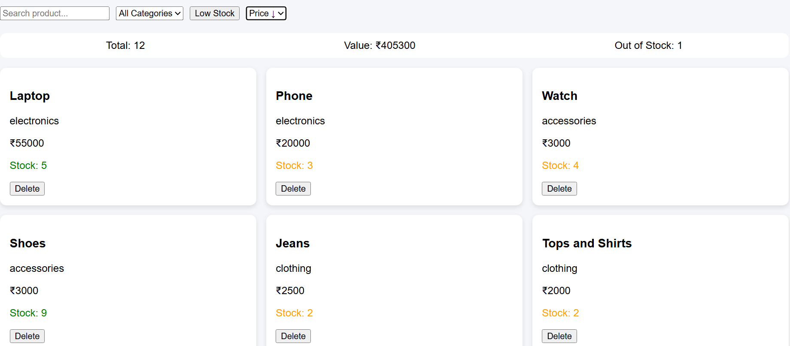
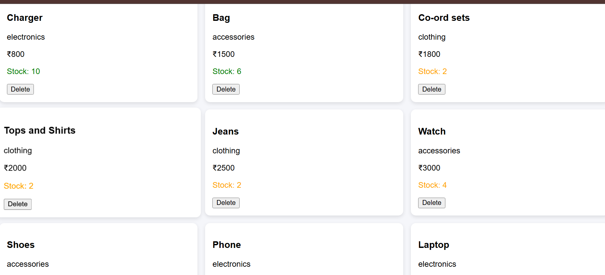

# Product Inventory Overview 

• Built a dynamic Product Inventory Dashboard using HTML, CSS, and JavaScript (no hardcoding)

• Implemented features like search, filter, sorting, and low stock tracking for better usability

• Added analytics section to show total products, inventory value, and out-of-stock items

• Used localStorage for data persistence and simulated API loading using Promise & setTimeout

# Features

• Dynamic product display 
• Quick search by product name
• Filter by category,price,name
• Low stock highlight
• Easy sorting (price & A–Z)
• Live inventory stats
• Add products with validation
• Delete products instantly
• Data saved in localStorage
• Fake loading for real feel
• “No results” message when empty

# Work-Flow

• First, I created the basic HTML layout with sections like header, controls, product area, analytics, and form

• After that, I added some simple CSS to make the UI clean and properly spaced

• Then I initialized the product data and started rendering products dynamically using JavaScript

• Next, I implemented search, category filter, and sorting so the product list updates based on user input

• After that, I added the low stock filter to highlight products with less quantity

• Then I worked on the analytics section to show total products, total value, and out-of-stock items

• Once that was done, I created the add product form with validation and connected it to the product list

• After that, I added delete functionality to remove products from both UI and storage

• Then I used localStorage so that data remains even after refreshing the page

• Finally, I added a loading delay using Promise and setTimeout to simulate real API behavior

# Tech Stack

• HTML5 – Used to build the overall structure and layout of the application
• CSS3 – Added styling to make the UI clean, organized, and visually appealing
• JavaScript (ES6) – Handled all the logic, dynamic rendering, and user interactions
• LocalStorage – Used to store data so it stays even after refreshing the page

## Folder Structure
- mini_app/product_inventory_dashboard/
  - index.html
  - style.css
  - script.js
  - screenshots/

# Screenshots

### Initial Layout
Basic structure with header and addded heading to the html page

 

### Controls Section
Provides search, filtering, and sorting options for managing products.

### Shows Plain HTML
Shows Plain HTML .

### Started Adding Css
Style Added to the Heading.

### Analytics
Displays total products, total value, and out-of-stock count.

### Add Product Form
Allows users to input product details with validation.

### Add Product
Adds a new product and updates inventory instantly.

### Search Functionality
Filters products in real-time based on user input.

### Category Filter
Displays products based on selected category.

### Low Stock Filter
Shows products with stock that is less.

### Sorting
Sorts products by price and name in different orders.

### Sorting2
Sorts products by Category here category is electronics.

### Shows final page after html css js
Shows final page that is responsive.

### Analytics.png
It will shows analytics of all after the products are added.

## Testing Checklist
- Add product → appears instantly
- Delete product → removed from UI and storage
- Search → real-time filtering
- Filters → correct results
- Sorting → correct order

## Error Handling
- Handles empty product list
- Displays message when no products found
- Validates form inputs
- Prevents invalid data

## Run the project
- Clone the repository
- Open the project folder
- Run index.html in browser or Live Server

## Project Status
- ✔ All required features implemented
- ✔ Fully tested and working

The application is fully responsive and a very great for learning.
